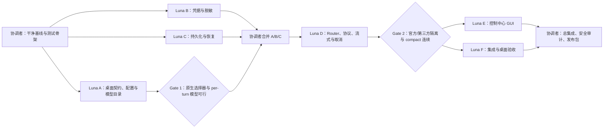

# Codex 官方订阅与第三方模型同任务热切换 Implementation Plan

> **For agentic workers:** REQUIRED SUB-SKILL: Use `superpowers:subagent-driven-development` (recommended) or `superpowers:executing-plans` to implement this plan task-by-task. Steps use checkbox (`- [ ]`) syntax for tracking.

**Goal:** 在 Windows Codex 桌面端保留官方 ChatGPT 登录与订阅通道，同时让用户在官方模型选择器中选择第三方模型；每次切换发生在一个 turn 的边界，同一任务、同一 GUI 对话记录继续存在，compact、长文本、工具、文件、重启恢复均不得静默丢失或串线。

**Architecture:** Codex/app-server 继续拥有任务、消息记录、compact 和 GUI；本项目只提供本地控制中心、模型目录与协议路由。所有可见模型都进入本地 Router，但“官方通道”和“第三方通道”实行硬隔离：官方通道只把 Codex 当前请求携带的官方身份送往已验证的官方上游；第三方通道丢弃入站官方身份，只从 Windows Credential Manager 读取对应密钥。Router 不创建第二份聊天历史，不做自己的摘要，只保存协议转换必需且加密的短期映射和恢复状态。

**Tech Stack:** Python 3.12、标准库 `sqlite3`/`http.server`、`httpx`（上游真流式与取消）、`keyring`（Windows Credential Manager）、`cryptography`（需要保存第三方 Chat 协议恢复片段时加密）、`pytest`、`ruff`、`pip-audit`、`detect-secrets`、PowerShell 验收脚本；首版沿用本地 Web GUI，不引入 React/Tauri。

---

## 0. 结论、范围和真实基线

### 0.1 本轮已观察到的基线

- 原始包位于 `D:\Users\kvxkf\Documents\xwechat_files\wxid_ij2s2ibl34p322_535f\temp\RWTemp\2026-08\18dfb3e254417d70044f1e10ade6a2ec\codex-model-switcher(1).zip`。
- 当前审查副本位于 `C:\Users\kvxkf\Documents\Codex\2026-08-05\new-chat\work\codex-model-switcher-inspect-fresh\codex-model-switcher`，不是 Git 仓库。
- 主程序 `codex_switcher.py` 约 2200 行；GUI、配置、Router、协议转换和状态均耦合在一个文件中。
- 当前已有：本地 Router、provider/slot 配置、生成模型目录、应用/还原 Codex 配置、Responses 直通、Chat 转换、GUI 和基础探测。
- 当前缺口包括：无测试工程、密钥可明文落盘、历史仅内存、取消接口未真正取消、流式为事后合成、WebSocket 为占位、Chat 转换会静默跳过部分 item、能力与上下文窗口可被错误默认、未验证真实桌面端同任务 compact/长文/工具/文件/重启恢复。
- 当前副本的 `catalog.json` 含真实凭据风险；任何 agent 都不得打印、复制、提交或放入测试夹具。

### 0.2 产品承诺边界

首版必须承诺：

1. 官方登录身份和实际推理路由是两个独立概念，UI 必须明确显示本轮走“官方订阅”还是“第三方 API”。
2. 用户可在 Codex 官方模型选择器中选择不同路由；切换仅在上一 turn 已完成或已成功取消后生效。
3. 同一任务内按“官方 → 第三方 → 官方”切换，任务 ID、GUI 消息记录和 compact 后的上下文仍连续。
4. 未支持的工具、文件、图片或协议 item 必须显式报错，绝不静默丢弃。
5. Router、Codex 或 Windows 重启后，官方 GUI 中已存在的任务由 Codex 恢复；协议映射由本项目恢复，不要求用户重新创建任务。
6. 第三方密钥不进 TOML/JSON/日志/SQLite 明文，不返回给 GUI，不转发给错误上游。

首版明确不承诺：

- 一个请求仍在生成或工具调用执行中时，把该请求中途迁移到另一个模型。
- 读取或统一展示官方订阅“剩余额度”；没有稳定官方接口就只显示路由与最近一次结果。
- 官方额度自动替第三方请求付费，或第三方额度自动计入官方订阅。
- 无提示的自动 fallback；首版由用户在下一 turn 主动选模型。
- 修改 Codex 安装包、注入 ASAR、打补丁或依赖坐标点击。
- 多用户云服务、团队计费、账号共享。

### 0.3 新产品仓库

不要在含凭据的解压目录里执行 `git init`。新仓库固定为：

`C:\Users\kvxkf\Documents\Codex\2026-08-05\new-chat\work\codex-model-switcher-product`

目标结构：

```text
codex-model-switcher-product/
├── pyproject.toml
├── .gitignore
├── README.md
├── docs/
│   ├── architecture.md
│   ├── protocol-contract.md
│   ├── security.md
│   └── acceptance.md
├── src/codex_model_switcher/
│   ├── __init__.py
│   ├── cli.py
│   ├── config.py
│   ├── catalog.py
│   ├── capabilities.py
│   ├── credentials.py
│   ├── crypto.py
│   ├── state.py
│   ├── models.py
│   ├── routing.py
│   ├── upstream.py
│   ├── router.py
│   ├── web.py
│   ├── adapters/
│   │   ├── __init__.py
│   │   ├── responses.py
│   │   └── chat.py
│   ├── templates/index.html
│   └── static/
│       ├── app.js
│       └── app.css
├── tests/
│   ├── conftest.py
│   ├── fixtures/
│   │   ├── catalogs/
│   │   └── responses/
│   ├── characterization/
│   ├── unit/
│   └── integration/
└── scripts/
    ├── smoke_desktop.ps1
    └── verify_release.ps1
```

禁止带入：`catalog.json`、真实 token、`.env`、`router.log`、`router.pid`、备份文件、`__pycache__`、本机绝对路径、原包中的大型前端构建资产。

## 1. 总体执行编排

最多同时运行 3 个 Luna。依赖关系如下：



执行轮次：

| 轮次 | 并行任务 | 进入条件 | 退出证据 |
|---|---|---|---|
| 0 | 协调者 | 无 | 干净 Git 基线、测试可运行、无秘密 |
| 1 | Luna A、B、C | 基线 commit 已固定 | 三个独立 commit、各自单测通过 |
| 2 | Luna D | A/B/C 已审查并合并 | 双通道路由、真流式、真取消、协议单测通过 |
| 3 | Luna E、F | Router API 和错误契约冻结 | GUI API/UI 测试与完整集成测试独立提交 |
| 4 | 协调者 | E/F 已审查 | 全量测试、真实桌面 smoke、原配置字节级还原 |
| 5 | 协调者 | 所有功能门通过 | 可安装包、回滚说明、发布证据 |

Task 0 commit 后创建第一轮 worktree：

```powershell
Set-Location 'C:\Users\kvxkf\Documents\Codex\2026-08-05\new-chat\work\codex-model-switcher-product'
git worktree add 'C:\Users\kvxkf\Documents\Codex\2026-08-05\new-chat\worktrees\cms-luna-a-contract' -b luna/catalog-contract main
git worktree add 'C:\Users\kvxkf\Documents\Codex\2026-08-05\new-chat\worktrees\cms-luna-b-credentials' -b luna/credentials main
git worktree add 'C:\Users\kvxkf\Documents\Codex\2026-08-05\new-chat\worktrees\cms-luna-c-state' -b luna/state-recovery main
```

A/B/C 合并并通过 unit tests 后创建 D；D 合并并冻结 Router 契约后创建 E/F：

```powershell
git worktree add 'C:\Users\kvxkf\Documents\Codex\2026-08-05\new-chat\worktrees\cms-luna-d-router' -b luna/router-protocol main
# 仅在 luna/router-protocol 已合并到 main 后执行下面两条
git worktree add 'C:\Users\kvxkf\Documents\Codex\2026-08-05\new-chat\worktrees\cms-luna-e-gui' -b luna/control-center-gui main
git worktree add 'C:\Users\kvxkf\Documents\Codex\2026-08-05\new-chat\worktrees\cms-luna-f-e2e' -b luna/e2e-acceptance main
```

Expected: `git worktree list` 显示每个角色独立目录和独立 branch；同一轮不存在两个 agent 指向同一 worktree。

## 2. 文件所有权与防冲突规则

| 角色 | 独占可编辑文件 | 禁止编辑 |
|---|---|---|
| 协调者 | `pyproject.toml`、`.gitignore`、`README.md`、`cli.py`、`__main__.py`、`docs/architecture.md`、合并冲突、发布文件 | 不在 Luna 工作期间重写其独占文件 |
| Luna A | `config.py`、`catalog.py`、`capabilities.py`、`models.py`、对应 unit tests 与 catalog fixtures | Router、凭据、状态、GUI、集成测试 |
| Luna B | `credentials.py`、脱敏逻辑及对应 unit tests | catalog/config、Router、GUI、状态 |
| Luna C | `crypto.py`、`state.py` 及对应 unit tests | 凭据后端实现、Router、GUI、catalog |
| Luna D | `routing.py`、`upstream.py`、`router.py`、`adapters/*` 及对应 unit tests | GUI、catalog/config、集成测试、`pyproject.toml` |
| Luna E | `web.py`、`templates/index.html`、`static/*`、`test_gui_api.py` | Router/adapters、状态、凭据、集成测试 |
| Luna F | `tests/integration/*`、`scripts/smoke_desktop.ps1`、`scripts/verify_release.ps1`、`docs/acceptance.md` | 所有生产模块；缺少 test seam 时只提交失败测试和报告 |

共同规则：

- 每个 Luna 使用独立 branch/worktree；不得多人共享同一个工作目录。
- 不编辑所有权之外的文件；需要依赖或接口调整时在交付报告中列出，由协调者完成。
- 测试先失败，再写最少实现使其通过；每个逻辑单元一个小 commit。
- 不修改真实 `C:\Users\kvxkf\.codex\config.toml`、`auth.json` 或现有任务数据。
- 不发起真实付费模型请求；真实 smoke 只在轮次 4 由协调者执行。
- 不读取或输出原 `catalog.json` 的值；所有 fixture 使用 `example.invalid` 和假 token。
- 完成时报告 branch、commit SHA、改动文件、精确测试命令与结果、剩余风险；不自行 merge/push。

## 3. Task 0：协调者建立干净、可回滚基线

**Files:**

- Create: `C:\Users\kvxkf\Documents\Codex\2026-08-05\new-chat\work\codex-model-switcher-product\pyproject.toml`
- Create: `C:\Users\kvxkf\Documents\Codex\2026-08-05\new-chat\work\codex-model-switcher-product\.gitignore`
- Create: `C:\Users\kvxkf\Documents\Codex\2026-08-05\new-chat\work\codex-model-switcher-product\src\codex_model_switcher\__init__.py`
- Create: `C:\Users\kvxkf\Documents\Codex\2026-08-05\new-chat\work\codex-model-switcher-product\tests\characterization\test_legacy_contract.py`
- Create: `C:\Users\kvxkf\Documents\Codex\2026-08-05\new-chat\work\codex-model-switcher-product\docs\provenance.md`

- [ ] 计算 ZIP、`codex_switcher.py`、README 的 SHA-256，只把文件名、大小、哈希和审查日期写入 `docs/provenance.md`，不记录聊天目录与用户隐私路径。

```powershell
Get-FileHash -Algorithm SHA256 -LiteralPath 'D:\Users\kvxkf\Documents\xwechat_files\wxid_ij2s2ibl34p322_535f\temp\RWTemp\2026-08\18dfb3e254417d70044f1e10ade6a2ec\codex-model-switcher(1).zip'
Get-FileHash -Algorithm SHA256 -LiteralPath 'C:\Users\kvxkf\Documents\Codex\2026-08-05\new-chat\work\codex-model-switcher-inspect-fresh\codex-model-switcher\codex_switcher.py'
```

Expected: 两个哈希成功返回；终端不出现任何凭据内容。

- [ ] 创建新仓库和 Python 工程；`pyproject.toml` 固定 Python `>=3.12`，运行依赖为 `httpx`、`keyring`、`cryptography`，开发依赖为 `pytest`、`pytest-timeout`、`ruff`、`pip-audit`、`detect-secrets`、`pyinstaller`。
- [ ] `.gitignore` 至少忽略 `.venv/`、`.env*`、`catalog.local.json`、`*.log`、`*.pid`、`*.bak*`、`__pycache__/`、`.pytest_cache/`、`.ruff_cache/`、`*.sqlite*`、`build/`、`dist/`。
- [ ] 只提取现有实现的公开行为，写 characterization tests；不要复制真实 catalog。若保留 legacy 源作参考，先扫描源码本身且放在 `reference/legacy_codex_switcher.py`，最终发布前删除。
- [ ] 写第一条失败测试，锁定“真实配置不被测试修改”。

```python
from pathlib import Path


def test_tests_never_point_at_real_codex_home(tmp_path, monkeypatch):
    isolated_home = (tmp_path / "isolated-codex-home").resolve()
    real_home = (Path.home() / ".codex").resolve()
    monkeypatch.setenv("CODEX_HOME", str(isolated_home))
    assert isolated_home != real_home
```

- [ ] 安装依赖并运行测试骨架。

```powershell
Set-Location 'C:\Users\kvxkf\Documents\Codex\2026-08-05\new-chat\work\codex-model-switcher-product'
python -m venv .venv
.\.venv\Scripts\python.exe -m pip install -e '.[dev]'
.\.venv\Scripts\python.exe -m pytest -q
.\.venv\Scripts\python.exe -m ruff check .
```

Expected: pytest 至少收集 1 个测试并通过；ruff 退出码 0。

- [ ] 运行只报告文件名的秘密扫描。

```powershell
$secretFiles = rg -l --hidden -g '!.git/**' -g '!.venv/**' '(sk-[A-Za-z0-9_-]{16,}|Bearer\s+[A-Za-z0-9._-]{16,}|api[_-]?key\s*=\s*["''][^"'']+)' .
if ($LASTEXITCODE -eq 0) { $secretFiles; exit 1 }
if ($LASTEXITCODE -gt 1) { exit $LASTEXITCODE }
```

Expected: 无输出，退出码 0。

- [ ] 初始化 Git 并提交基线。

```powershell
git init -b main
git add .gitignore pyproject.toml src tests docs
git diff --cached --check
git commit -m 'chore: establish sanitized product baseline'
```

Expected: `main` 有一个干净基线 commit，`git status --short` 无输出。

## 4. Task 1 / Luna A：桌面契约、配置和原生模型目录

**Files:** `config.py`、`catalog.py`、`capabilities.py`、`models.py`、`tests/unit/test_config.py`、`tests/unit/test_catalog.py`、`tests/unit/test_capabilities.py`、`tests/fixtures/catalogs/*`、`docs/protocol-contract.md`

### 4.1 先验证三个 go/no-go 门

- [ ] 从当前安装的 Codex 模型缓存读取 `client_version`，生成目录时动态沿用，禁止硬编码 `0.147.0`。
- [ ] 用隔离 `CODEX_HOME` 验证本地 provider + `model_catalog_json` 可让模型出现在当前客户端可解析的 picker schema 中。
- [ ] 用当前 app-server 契约确认 `turn/start` 可在同一 thread 的下一 turn 指定另一个模型；记录“完成/取消后切换”的边界。
- [ ] 确认送到 Router 的请求里是否存在可验证、稳定且不含隐私的 thread/turn correlation 字段；若不存在，不虚构 ID，由 app-server 负责同 thread 串行边界，Router 只管理自身活动连接。
- [ ] 确认 compact 由 app-server/thread 层拥有；Router 不发起第二次 compact，也不写入第二份摘要。
- [ ] 对官方上游 URL、请求头和认证行为，只接受当前安装客户端或官方文档能证明的值；无法证明就让 Gate 1 失败，不猜测 endpoint。

Gate 1 通过条件：原生目录 schema 可被当前客户端接受；同一 thread 的连续 turn 可带不同 model ID；官方认证契约有可审查证据。任何一项失败，停止后续 Router 开发并报告限制。

### 4.2 配置与目录接口

```python
@dataclass(frozen=True)
class ModelCapability:
    context_window: int
    supports_responses: bool
    supports_streaming: bool
    supports_tools: bool
    supports_images: bool
    supports_files: bool
    supports_compaction_context: bool

@dataclass(frozen=True)
class ModelRoute:
    model_id: str
    display_name: str
    lane: Literal["official", "third_party"]
    provider_id: str
    upstream_model: str
    capability: ModelCapability
```

- [ ] model ID 必须稳定且可读，例如 `cms-official-gpt-5-6`、`cms-deepseek-chat`；display name 明确加 `Official` 或 `API` 标记。
- [ ] 能力字段缺失时禁止启用该 route；不得给所有模型统一填 `258400`。
- [ ] 配置写入使用受管区块、临时文件 + 原子替换、写前哈希和时间戳备份。
- [ ] restore 必须验证当前文件仍等于本项目最后一次写入的哈希；检测到用户后来编辑时拒绝覆盖，并给出安全恢复路径。
- [ ] app 配置应用/恢复做字节级 round-trip 测试。

```python
def test_apply_then_restore_is_byte_exact(tmp_path):
    original = b'# user comment\nmodel = "gpt-5.6"\n'
    config_path = tmp_path / "config.toml"
    config_path.write_bytes(original)
    receipt = apply_managed_config(config_path, sample_catalog_path(tmp_path))
    restore_managed_config(config_path, receipt)
    assert config_path.read_bytes() == original
```

- [ ] 运行并提交。

```powershell
.\.venv\Scripts\python.exe -m pytest -q tests/unit/test_config.py tests/unit/test_catalog.py tests/unit/test_capabilities.py
.\.venv\Scripts\python.exe -m ruff check src/codex_model_switcher/config.py src/codex_model_switcher/catalog.py src/codex_model_switcher/capabilities.py src/codex_model_switcher/models.py tests/unit
git add src/codex_model_switcher/config.py src/codex_model_switcher/catalog.py src/codex_model_switcher/capabilities.py src/codex_model_switcher/models.py tests/unit tests/fixtures/catalogs docs/protocol-contract.md
git commit -m 'feat: define native model catalog and config contract'
```

Expected: 目录、配置、能力测试全部通过；commit 不包含本机模型密钥或真实认证头。

## 5. Task 2 / Luna B：Windows 凭据和全链路脱敏

**Files:** `credentials.py`、`tests/unit/test_credentials.py`、`tests/unit/test_redaction.py`

- [ ] 先写失败测试，证明 provider JSON 中只能保存 `credential_ref`，不能保存 bearer 值。
- [ ] 定义可替换接口，单测使用内存 fake，生产实现使用 Windows Credential Manager。

```python
class CredentialStore(Protocol):
    def set(self, provider_id: str, secret: str) -> None: ...
    def get(self, provider_id: str) -> str: ...
    def delete(self, provider_id: str) -> None: ...
    def exists(self, provider_id: str) -> bool: ...
```

- [ ] service name 固定为 `CodexModelSwitcher`，username 使用经过验证的 provider ID；禁止把 base URL、账号邮箱或 token 拼进日志。
- [ ] GUI 的写入接口返回 `configured: true/false`，从不返回 secret、长度、前后缀或可用于猜测的 hash。
- [ ] 编写递归脱敏器，覆盖 header、query、JSON、异常对象、SSE 片段和子进程环境摘要。
- [ ] 所有日志默认只记录 route ID、状态码、耗时、字节数和 trace ID，不记录 prompt、文件内容、Authorization。
- [ ] 对旧明文 catalog 只提供显式迁移函数：先写 Credential Manager，验证能读回，再生成不含 secret 的新 catalog；原文件不自动删除。
- [ ] 写测试证明入站官方 bearer 永远不能被 `third_party` 凭据解析路径返回。

```python
def test_third_party_credential_ignores_inbound_authorization(store):
    store.set("deepseek", "t-key")
    resolved = resolve_upstream_auth(
        lane="third_party",
        provider_id="deepseek",
        inbound_authorization="Bearer test-auth",
        credential_store=store,
    )
    assert resolved == "Bearer t-key"
    assert "test-auth" not in resolved
```

- [ ] 运行并提交。

```powershell
.\.venv\Scripts\python.exe -m pytest -q tests/unit/test_credentials.py tests/unit/test_redaction.py
.\.venv\Scripts\python.exe -m ruff check src/codex_model_switcher/credentials.py tests/unit/test_credentials.py tests/unit/test_redaction.py
git add src/codex_model_switcher/credentials.py tests/unit/test_credentials.py tests/unit/test_redaction.py
git commit -m 'feat: isolate provider credentials and redact secrets'
```

Expected: fake credential backend 测试通过，测试日志中不出现任何 fixture secret。

## 6. Task 3 / Luna C：持久化、重启恢复和加密协议状态

**Files:** `crypto.py`、`state.py`、`tests/unit/test_crypto.py`、`tests/unit/test_state.py`

Codex 仍是消息历史的唯一权威。本模块只保存：route 选择、上游 response ID 映射、第三方 Chat 协议为继续一轮所必需的上下文片段、配置 receipt 和取消句柄元数据。

- [ ] SQLite 使用 schema version 和 WAL；每次迁移在事务中完成。
- [ ] 不保存入站官方 token、第三方明文 key、完整文件内容或默认完整 prompt 日志。
- [ ] Chat 适配所需文本片段采用 Fernet 加密；加密主密钥通过注入的 `SecretKeyProvider` 获取，生产集成后落 Windows Credential Manager。
- [ ] crash 后重开数据库可以恢复 response link；compact 边界后旧链条可被安全剪枝。
- [ ] 数据库损坏时先复制为带时间戳的 quarantine 文件并显式失败；禁止悄悄创建空库造成“会话没了”的假象。
- [ ] 所有删除都只针对已过期映射且在事务内执行；用户任务历史不在本数据库中，因此不允许出现“删除 Codex thread”的 API。

```python
def test_response_link_survives_process_reopen(tmp_path, secret_key_provider):
    path = tmp_path / "state.sqlite3"
    first = StateStore(path, secret_key_provider)
    first.link_response("local-1", "upstream-7", route_id="deepseek")
    first.close()
    second = StateStore(path, secret_key_provider)
    assert second.get_response_link("local-1").upstream_id == "upstream-7"
```

- [ ] 运行并提交。

```powershell
.\.venv\Scripts\python.exe -m pytest -q tests/unit/test_crypto.py tests/unit/test_state.py
.\.venv\Scripts\python.exe -m ruff check src/codex_model_switcher/crypto.py src/codex_model_switcher/state.py tests/unit/test_crypto.py tests/unit/test_state.py
git add src/codex_model_switcher/crypto.py src/codex_model_switcher/state.py tests/unit/test_crypto.py tests/unit/test_state.py
git commit -m 'feat: persist encrypted routing state across restarts'
```

Expected: 重开、迁移、加密、损坏保护和 compact 剪枝测试通过。

## 7. Task 4 / Luna D：Router、协议保真、真流式和真取消

**Files:** `routing.py`、`upstream.py`、`router.py`、`adapters/responses.py`、`adapters/chat.py`、对应 unit tests

进入条件：Luna A/B/C 的 commit 已由协调者审查并合并，`ModelRoute`、`CredentialStore`、`StateStore` 接口冻结。

### 7.1 路由与认证硬隔离

- [ ] route 只由已生成 catalog 中的稳定 model ID 决定；未知 model ID 返回结构化 404，不猜 provider。
- [ ] official route：仅向已验证官方 host 转发入站官方认证；host 不匹配立即拒绝。
- [ ] third-party route：先删除所有入站 `Authorization`、cookie 和 OpenAI 账号相关 header，再由 `CredentialStore` 注入第三方凭据。
- [ ] redirect 默认关闭；若上游返回 redirect，只有目标 host 仍在同一 route allowlist 才能跟随。
- [ ] 单测以两个 fake host 记录 header，证明 token 没有串线。

### 7.2 Responses 保真与 Chat 显式能力矩阵

- [ ] Responses → Responses 路径尽量字节/字段直通；未知 JSON item 不得被解析后丢弃。
- [ ] Chat 转换使用显式 allowlist，覆盖 message、function call、function output、文本和已验证的图片形式。
- [ ] `input_file`、web search、computer use、reasoning、compact item 等若上游 Chat 协议没有等价表示，返回 422，响应体包含 `unsupported_item_types`；禁止 `continue` 静默跳过。
- [ ] 上游响应缺失 usage、finish reason 或 response ID 时，使用明确的兼容字段并记录 capability warning，不伪造“完整支持”。
- [ ] 对上下文窗口只使用 route capability；达到软阈值时提示 Codex 先 compact，达到硬阈值时返回 413/422，不截断正文。

```python
def test_chat_adapter_rejects_input_file_instead_of_dropping_it():
    request = responses_request_with_input_file("manual.pdf")
    with pytest.raises(UnsupportedItemError) as error:
        to_chat_completions(request)
    assert error.value.item_types == {"input_file"}
```

### 7.3 流式、背压和取消

- [ ] 当客户端请求 stream 时，边读上游边写客户端，不等完整响应后合成 SSE。
- [ ] 保留 SSE event 顺序和 event ID；断线后停止读取并关闭上游连接。
- [ ] 每个活动请求注册 cancel handle；取消 API 和客户端断开都触发上游取消，并等待资源释放。
- [ ] 限制并发数、header/body 大小和超时；超限显式返回，不静默截断长文。
- [ ] 不实现假 WebSocket。未支持的 WebSocket endpoint 返回明确 501 和说明。

### 7.4 compact 和切换边界

- [ ] Router 不生成摘要。收到 Codex 产生的 compact 后上下文时，把它视为下一请求的权威输入。
- [ ] 若 Task 1 已证明 Router 能获得稳定 thread correlation，则同一 thread 有活动请求时，另一 model ID 的请求返回 409 `turn_in_progress`；若没有该字段，由 app-server 的 turn 串行契约阻止中途切换，Router 不用 prompt 内容或临时猜测值关联 thread。
- [ ] 切换 route 时清除不兼容的 `previous_response_id`，但保留 Codex 本次发来的 compact/消息上下文；不得把官方 response ID 发送到第三方，反之亦然。
- [ ] 记录 route change event，仅含 old/new route ID、thread correlation ID 和时间，不含正文。

- [ ] 运行并提交。

```powershell
.\.venv\Scripts\python.exe -m pytest -q tests/unit/test_routing.py tests/unit/test_responses_adapter.py tests/unit/test_chat_adapter.py tests/unit/test_streaming.py tests/unit/test_cancellation.py
.\.venv\Scripts\python.exe -m ruff check src/codex_model_switcher/routing.py src/codex_model_switcher/upstream.py src/codex_model_switcher/router.py src/codex_model_switcher/adapters tests/unit
git add src/codex_model_switcher/routing.py src/codex_model_switcher/upstream.py src/codex_model_switcher/router.py src/codex_model_switcher/adapters tests/unit
git commit -m 'feat: route official and third-party turns without protocol loss'
```

Expected: 认证隔离、未知 item、上下文边界、流式、断线和取消测试全部通过。

Gate 2 通过条件：基于注入式 fake transport 的 unit tests 同时证明 official/third-party header 隔离、跨 route 不复用 response ID、compact 后权威输入被原样保留、首个 SSE event 在上游结束前到达、取消关闭上游、未知 item 不会静默丢失。缺少任一证据时，不派发 GUI 和完整 E2E。

## 8. Task 5 / Luna E：控制中心 GUI，而不是第二个聊天界面

**Files:** `web.py`、`templates/index.html`、`static/app.js`、`static/app.css`、`tests/unit/test_gui_api.py`

GUI 只管理 provider、模型、凭据引用、路由、Codex 配置应用/还原和运行状态。用户仍在 Codex 官方 GUI 中聊天、看历史和点击模型。

- [ ] 首页显示四个核心状态：Router、Codex 配置是否受管、官方身份是否可用、每条 route 是否 ready。
- [ ] Provider 表单字段：名称、base URL、协议、模型 ID、上下文窗口、stream/tools/images/files 支持、认证方式；能力字段必须明确填写。
- [ ] official route 是独立只读身份状态，不出现 API key 输入框；third-party route 的 key 输入是 write-only，保存后只显示“已配置”。
- [ ] 模型表显示 native picker 名称、route lane、上游模型、能力、最近探测结果和最近成功时间。
- [ ] 提供原子操作：保存 provider、保存 credential、探测、生成目录、应用 Codex 配置、恢复配置、启动/停止 Router。
- [ ] 应用配置前展示将修改的文件和当前备份 receipt；检测外部编辑时阻止覆盖。
- [ ] GUI 不提供完整 prompt/response 查看器，不显示 bearer，不把 token 写入 DOM、localStorage、URL 或错误 toast。
- [ ] API 至少包含：`GET /api/status`、`GET/POST /api/providers`、`POST /api/providers/{id}/credential`、`POST /api/providers/{id}/probe`、`GET /api/models`、`POST /api/config/apply`、`POST /api/config/restore`、`POST /api/router/start`、`POST /api/router/stop`。
- [ ] 所有 POST 要求 loopback 来源和随机启动 token/CSRF header；server 只绑定 `127.0.0.1`。

```python
def test_provider_get_never_returns_secret(gui_client, credential_store):
    credential_store.set("deepseek", "fixture-secret-never-return")
    body = gui_client.get("/api/providers").json()
    assert body[0]["credential_configured"] is True
    assert "fixture-secret-never-return" not in repr(body)
```

- [ ] 运行并提交。

```powershell
.\.venv\Scripts\python.exe -m pytest -q tests/unit/test_gui_api.py
.\.venv\Scripts\python.exe -m ruff check src/codex_model_switcher/web.py tests/unit/test_gui_api.py
git add src/codex_model_switcher/web.py src/codex_model_switcher/templates/index.html src/codex_model_switcher/static tests/unit/test_gui_api.py
git commit -m 'feat: add secure local routing control center'
```

Expected: GUI API 测试通过；响应、HTML、JS 和浏览器存储中均无 secret。

## 9. Task 6 / Luna F：集成测试、原生桌面 smoke 与证据包

**Files:** `tests/integration/*`、`scripts/smoke_desktop.ps1`、`scripts/verify_release.ps1`、`docs/acceptance.md`

Luna F 不修改生产模块。若观察到产品 bug，先写能稳定复现的失败测试，报告给协调者/Luna D 或 E 修复。

### 9.1 两个可观测 fake upstream

- [ ] fake official Responses upstream 支持非流式、逐 event SSE、工具调用、compact fixture、延迟和取消观测。
- [ ] fake third-party Chat upstream 支持流式 delta、function calling、长响应、429/5xx 和取消观测。
- [ ] upstream 只记录 header 名和认证来源标签，不把 header 值写测试输出。
- [ ] `verify_release.ps1` 对临时 clean artifact 应通过，对注入一个高熵假 token 的临时 artifact 必须失败；扫描器自身的签名定义不得造成自匹配假阳性。

### 9.2 必须自动化的场景

- [ ] `test_official_lane_forwards_only_official_auth`
- [ ] `test_third_party_lane_never_receives_inbound_chatgpt_auth`
- [ ] `test_same_thread_switches_official_third_party_official`
- [ ] `test_switch_rejected_while_previous_turn_active`
- [ ] `test_cancel_propagates_to_upstream`
- [ ] `test_stream_events_arrive_before_upstream_finishes`
- [ ] `test_compaction_context_is_not_compacted_twice`
- [ ] `test_switch_after_compaction_keeps_summary_and_recent_turns`
- [ ] `test_router_restart_recovers_response_mapping`
- [ ] `test_long_input_is_never_silently_truncated`
- [ ] `test_unknown_response_item_is_forwarded_or_explicitly_rejected`
- [ ] `test_input_file_and_tool_capability_matrix`
- [ ] `test_config_restore_is_byte_exact_after_smoke`

```powershell
.\.venv\Scripts\python.exe -m pytest -q tests/integration
```

Expected: fake upstream 测试全部通过，测试总时长有上限，不依赖外网或付费 key。

### 9.3 真实 Windows Codex 桌面 smoke

`smoke_desktop.ps1` 必须：

1. 检查 Codex 桌面版本、app-server/CLI 版本、当前配置路径和 15722 端口占用。
2. 对真实 `config.toml` 和模型缓存做字节备份与 SHA-256；不复制或打印 `auth.json`。
3. 只在 `-ApplyRealConfig` 显式开关存在时应用本项目配置。
4. 启动 Router，确认 PID 命令行与监听地址。
5. 验证 native picker 可见一条 official 和一条 third-party 模型。
6. 在同一测试 task 中执行：official turn → third-party turn → `thread/compact/start` → official turn。
7. 重启 Router，resume 同一 task，再执行一轮；随后重启 Codex，确认 GUI 中任务仍可见并能继续。
8. 验证一条长文本、一条工具调用和一条文件/图片输入；不支持时必须看到结构化错误而不是缺内容。
9. 在 `finally` 中停止测试 Router、恢复原配置并比较 SHA-256；恢复失败时立即高亮并保留备份，不继续清理证据。
10. 输出不含 token 的 JSON 证据：版本、模型名、task/thread ID、每轮 route、状态、compact 次数、重启恢复结果、配置恢复 hash。

真实付费 third-party smoke 默认不运行，并由单独的 `-RunPaidThirdPartySmoke` 开关保护；公开发布前需要用户确认后向至少一个真实第三方 provider 发送一条最短请求。若跳过，只能报告“fake upstream 已本地验证”，不能报告真实第三方已验证。

- [ ] 提交测试和脚本。

```powershell
git add tests/integration scripts/smoke_desktop.ps1 scripts/verify_release.ps1 docs/acceptance.md
git commit -m 'test: cover hot switching compaction and restart recovery'
```

## 10. Task 7：协调者合并、修复和完整功能门

### 10.1 合并顺序

1. 审查并合并 Luna A。
2. 审查并合并 Luna B。
3. 审查并合并 Luna C。
4. 跑全量 unit tests，冻结接口。
5. 审查并合并 Luna D。
6. 跑 Router unit tests 和最小 fake-upstream smoke。
7. 审查并合并 Luna E、F；若同一测试 fixture 冲突，由协调者手工整合。

每次 merge 前：

```powershell
git status --short
git log --oneline --decorate -n 20
git diff main...HEAD --check
```

Expected: 工作树干净、commit 边界清楚、无 whitespace error。

### 10.2 全量自动化门

- [ ] 协调者连接最终 CLI：`python -m codex_model_switcher gui|router|status|config apply|config restore`，并用 `tests/unit/test_cli.py` 覆盖退出码、错误输出和只读 status；CLI 不打印 credential。
- [ ] 删除所有生产代码对 `reference/legacy_codex_switcher.py` 的 import；确认新模块已覆盖必要路径后，由协调者从发布树移除 reference 文件，Git 历史仍可回滚。

```powershell
.\.venv\Scripts\python.exe -m pytest -q
.\.venv\Scripts\python.exe -m ruff check .
.\.venv\Scripts\python.exe -m pip_audit
.\scripts\verify_release.ps1
```

Expected:

- pytest 收集 unit + integration 测试，不允许 0 tests。
- ruff 退出码 0。
- 依赖审计无未处理高危漏洞；若上游尚无修复版本，记录包、CVE、实际可达性和缓解措施。
- release 验证确认无秘密、无日志、无 pid、无备份、无用户绝对路径、无大型无用前端资产。

### 10.3 功能验收矩阵

| 验收项 | 自动化证据 | 真实桌面证据 | 发布门 |
|---|---|---|---|
| 原生 picker 同时显示 official/API | catalog schema test | 当前 Codex 截图或 app-server 读取 | 必须 |
| 官方认证只到官方 host | fake header test | Router 脱敏 trace | 必须 |
| 第三方 key 只到对应 provider | fake header test | 经确认的最短付费 smoke | 公开发布必须 |
| 同一 task 三次切换 | integration test | task/thread ID 不变 | 必须 |
| compact 不冲突 | compact fixture test | compact 次数为 1 且后续连续 | 必须 |
| 长文不丢失 | hash/length test | 接近能力上限的输入 | 必须 |
| 工具/文件/图片 | capability matrix | 至少各一例 | 必须 |
| Router 重启恢复 | SQLite reopen test | resume 同一 task | 必须 |
| Codex 重启后 GUI 仍显示 | 不适用 | 原任务可见并继续 | 必须 |
| 真流式 | 首 event 时间测试 | UI 在结束前出现增量 | 必须 |
| 真取消 | upstream cancel observer | GUI 取消后无继续计费流 | 必须 |
| 配置安全回滚 | byte-roundtrip test | 前后 SHA-256 相同 | 必须 |

任何“只看到 HTTP 200”都不能替代消息、header、state、GUI 和回滚副作用证据。

## 11. Task 8：Windows 可用产品包

功能门全部通过后才做此任务；不在此阶段重写 UI 框架。

- [ ] 使用 PyInstaller `onedir` 构建，避免首版 `onefile` 自解压和杀毒误报变量。
- [ ] 创建 `packaging/codex-model-switcher.spec`，入口为 `src/codex_model_switcher/__main__.py`，显式收集 templates/static，不从用户数据目录收集文件。
- [ ] 包含 `Codex Model Switcher.exe`、静态 GUI、版本信息、第三方许可证、README；不包含本机 catalog/state/credential。
- [ ] 首次运行创建用户级数据目录和 Credential Manager service；卸载不主动删除凭据与配置备份。
- [ ] 提供开始菜单/桌面快捷方式和明确的“恢复 Codex 原配置”入口。
- [ ] 在一台没有源码环境的 Windows 用户账户上做冷启动：安装 → 添加假 provider → 生成目录 → 启动 Router → 恢复配置 → 卸载。
- [ ] 发布前再次运行 `verify_release.ps1` 和真实桌面 smoke 的配置恢复段。

```powershell
.\.venv\Scripts\pyinstaller.exe --noconfirm packaging\codex-model-switcher.spec
.\scripts\verify_release.ps1 -ArtifactPath '.\dist\Codex Model Switcher'
```

Expected: 构建产物可启动、只监听 loopback、无秘密，卸载后原 Codex 配置 hash 保持一致。

## 12. 六个 Luna 的可复制任务指令

协调者先完成 Task 0，并创建以下 worktree；随后把对应文本原样发给 Luna。低价模型足以完成分模块编码；遇到 Gate 1、认证边界或 compact 语义不确定时停止，不用猜。

### Luna A：桌面契约、配置、目录

```text
你负责 codex-model-switcher-product 的 Task 1：桌面契约、配置与原生模型目录。

工作目录：C:\Users\kvxkf\Documents\Codex\2026-08-05\new-chat\worktrees\cms-luna-a-contract
分支：luna/catalog-contract
先完整阅读：C:\Users\kvxkf\Documents\Codex\2026-08-05\new-chat\docs\superpowers\plans\2026-08-05-codex-dual-lane-hot-switch.md

只可编辑：config.py、catalog.py、capabilities.py、models.py、对应 unit tests、catalog fixtures、docs/protocol-contract.md。不得编辑 pyproject、Router、凭据、状态、GUI、集成测试。

先以失败测试锁定当前 Codex 客户端可接受的 catalog/config schema，再实现。client_version 必须动态读取；能力缺失时 route 不得启用；配置 apply/restore 必须原子且字节级可还原。用隔离 CODEX_HOME 做测试，不修改真实 C:\Users\kvxkf\.codex。官方 endpoint/auth 契约只能依据当前安装客户端或官方文档；无法证明就让 Gate 1 失败并报告，不猜。

完成后：运行你负责的 pytest 和 ruff；分小 commit 提交；不要 merge/push。回复 branch、commit SHA、文件、精确测试结果、Gate 1 结论、未知风险。禁止读取或输出原 catalog.json 的 secret。
```

### Luna B：凭据与脱敏

```text
你负责 codex-model-switcher-product 的 Task 2：Windows Credential Manager 凭据与全链路脱敏。

工作目录：C:\Users\kvxkf\Documents\Codex\2026-08-05\new-chat\worktrees\cms-luna-b-credentials
分支：luna/credentials
先完整阅读：C:\Users\kvxkf\Documents\Codex\2026-08-05\new-chat\docs\superpowers\plans\2026-08-05-codex-dual-lane-hot-switch.md

只可编辑 credentials.py、test_credentials.py、test_redaction.py。不得编辑 pyproject、catalog/config、Router、state、GUI、integration。

严格 TDD。生产后端使用 keyring/Windows Credential Manager，测试使用内存 fake。任何 GET/API/log/异常都不能回显 secret。写测试证明 third_party 路径忽略入站 ChatGPT Authorization，只读取对应 provider credential。旧明文 catalog 只做显式、安全迁移，不能自动删除原文件。

完成后运行负责范围的 pytest 与 ruff，分小 commit；不要 merge/push。回复 branch、commit SHA、文件、测试结果和安全风险。不得访问或打印真实 catalog.json/auth.json。
```

### Luna C：持久化与恢复

```text
你负责 codex-model-switcher-product 的 Task 3：加密协议状态、SQLite 持久化和重启恢复。

工作目录：C:\Users\kvxkf\Documents\Codex\2026-08-05\new-chat\worktrees\cms-luna-c-state
分支：luna/state-recovery
先完整阅读：C:\Users\kvxkf\Documents\Codex\2026-08-05\new-chat\docs\superpowers\plans\2026-08-05-codex-dual-lane-hot-switch.md

只可编辑 crypto.py、state.py、test_crypto.py、test_state.py。不得编辑 pyproject、credential 后端、Router、GUI、catalog、integration。

Codex 是 task/transcript/compact 的唯一权威；本模块只保存协议映射、route event、receipt 和 Chat 适配必要片段。SQLite 使用 WAL、事务迁移；敏感片段加密；绝不保存官方 token、第三方 key 或完整文件。数据库损坏先 quarantine 并显式失败，不静默重建。SecretKeyProvider 用接口注入，避免与 Luna B 冲突。

严格 TDD，覆盖 reopen、migration、compact prune、corruption、并发。完成后运行 pytest/ruff，分小 commit；不要 merge/push。回复 branch、SHA、文件、结果、风险。
```

### Luna D：Router 与协议

```text
你负责 codex-model-switcher-product 的 Task 4：双通道 Router、协议保真、真 SSE 和真取消。

工作目录：C:\Users\kvxkf\Documents\Codex\2026-08-05\new-chat\worktrees\cms-luna-d-router
分支：luna/router-protocol
先完整阅读：C:\Users\kvxkf\Documents\Codex\2026-08-05\new-chat\docs\superpowers\plans\2026-08-05-codex-dual-lane-hot-switch.md
开始前确认 A/B/C 已合并到你的基线；若未合并，停止并报告。

只可编辑 routing.py、upstream.py、router.py、adapters/* 和对应 unit tests。不得编辑 pyproject、catalog/config、credential/state 实现、GUI、tests/integration。

关键不变量：official auth 只到已验证 official host；third_party 先删除入站 ChatGPT auth 再注入 provider key；Responses 未知 item 直通或显式拒绝；Chat 无法等价转换的 item 返回 422，绝不静默跳过；SSE 必须边收边发；取消必须关闭上游；Router 不自行 compact；同一 turn 中不换模型，完成/取消后才可换；跨 route 不复用 previous_response_id。

严格 TDD。完成后运行负责范围 pytest/ruff，分小 commit；不要 merge/push。回复 branch、SHA、文件、测试精确结果和未支持能力矩阵。不得发真实付费请求。
```

### Luna E：控制中心 GUI

```text
你负责 codex-model-switcher-product 的 Task 5：安全的本地控制中心 GUI。

工作目录：C:\Users\kvxkf\Documents\Codex\2026-08-05\new-chat\worktrees\cms-luna-e-gui
分支：luna/control-center-gui
先完整阅读：C:\Users\kvxkf\Documents\Codex\2026-08-05\new-chat\docs\superpowers\plans\2026-08-05-codex-dual-lane-hot-switch.md
开始前确认 Luna D 的 Router API/错误契约已冻结。

只可编辑 web.py、templates/index.html、static/app.js、static/app.css、test_gui_api.py。不得编辑 Router/adapters、catalog/config、credentials/state、integration、pyproject。

GUI 是 provider/credential/route/config/router 控制中心，不做第二个聊天窗口。官方身份只读显示，第三方 key write-only。不能把 secret 放进响应、DOM、URL、localStorage 或日志。只绑定 127.0.0.1，所有 POST 校验随机启动 token/CSRF。实现状态、provider、模型、探测、生成目录、应用/恢复配置、启停 Router 的完整用户路径。

严格 TDD。完成后运行 test_gui_api 与 ruff，分小 commit；不要 merge/push。回复 branch、SHA、文件、测试结果、API 契约和仍需协调者处理的接口差异。
```

### Luna F：集成与桌面验收

```text
你负责 codex-model-switcher-product 的 Task 6：fake-upstream 集成测试、Windows Codex 桌面 smoke 脚本和验收证据。

工作目录：C:\Users\kvxkf\Documents\Codex\2026-08-05\new-chat\worktrees\cms-luna-f-e2e
分支：luna/e2e-acceptance
先完整阅读：C:\Users\kvxkf\Documents\Codex\2026-08-05\new-chat\docs\superpowers\plans\2026-08-05-codex-dual-lane-hot-switch.md
开始前确认 Luna D 的 Router 契约已冻结。

只可编辑 tests/integration/*、scripts/smoke_desktop.ps1、scripts/verify_release.ps1、docs/acceptance.md。不得修改任何生产模块；缺 test seam 或发现 bug 时提交稳定失败测试并报告。

覆盖：官方/第三方认证不串线，同一 thread 官方→第三方→官方，turn 活跃时拒绝切换，真流式首 event 时序，取消传播，compact 只发生一次且切换后连续，Router 重启恢复，长文不截断，未知 item/工具/文件/图片显式能力结果，配置字节级回滚。真实 smoke 必须默认只读；只有 -ApplyRealConfig 才修改真实配置，且 finally 中恢复并比较 SHA-256。不得打印 auth/token，不发默认付费请求。

完成后运行 integration pytest；提交但不 merge/push。回复 branch、SHA、文件、测试精确结果、哪些是自动化证据、哪些仍待真实桌面验证。
```

## 13. 切换低价模型后的协调者启动指令

把下面这段发给新的低价模型即可开始。第一轮只做 Task 0，不要一次性放出六个 Luna。

```text
请执行这份开发计划：
C:\Users\kvxkf\Documents\Codex\2026-08-05\new-chat\docs\superpowers\plans\2026-08-05-codex-dual-lane-hot-switch.md

你是集成协调者。先完整阅读计划和现有审查材料，只执行 Task 0：在指定的新目录创建不含 secret 的 Git 基线、测试骨架并验证。不要在原解压目录 git init，不要读取/打印 catalog.json 的凭据，不要修改真实 C:\Users\kvxkf\.codex 配置。

Task 0 通过后，创建 A/B/C 三个独立 worktree，把计划第 12 节对应指令分别交给三个 Luna，最多并行 3 个。等待它们返回后逐个审查 diff、测试和 commit；先通过 Gate 1，再按计划进入 D，随后并行 E/F。任何 agent 不得越过文件所有权；任何真实桌面配置修改和付费请求都留到协调者最终验收，并遵守备份/显式开关/字节级恢复。

每轮向我报告：已完成到 EDITED/LOCALLY_VERIFIED/COMMITTED 的哪一级、commit SHA、测试数量与结果、已通过的 Gate、下一轮要派出的 Luna。不要把计划当成果，不要声称未运行的测试通过。
```

## 14. 成本与停止条件

- 低价模型承担：基线、模块实现、单测、常规 review、GUI 和脚本。
- 只在以下窄问题升级高价模型：当前 Codex 官方认证 endpoint 无法从证据确定；compact item 在跨 route 时语义冲突；流式/取消存在难以复现的并发竞态；安全 review 发现跨通道 token 风险。
- Gate 1 失败立即停止 A 之后的功能开发，避免把钱花在一个无法进入原生 picker 的架构上。
- Gate 2（认证隔离 + 同 thread 切换 + compact fixture）失败时，不进入 GUI 美化和打包。
- 预计净开发量约 6–10 个工程日；按上述并行方式通常是 3–6 个日历日，真实桌面兼容问题会决定是否增加缓冲。这是风险估算，不是已经完成的进度。

## 15. Definition of Done

只有同时满足以下条件，才能称为“可以给别人使用的功能版”：

- [ ] clean repo、构建产物和日志秘密扫描为零。
- [ ] 当前 Windows Codex 原生 picker 可见 official 与 third-party 模型。
- [ ] 同一真实 task 完成 official → third-party → compact → official，并保持 GUI 记录。
- [ ] Router 与 Codex 各重启一次后仍能 resume。
- [ ] 长文、流式、取消、工具、文件、图片有实际证据；不支持项有明确错误。
- [ ] 第三方 key 在 Windows Credential Manager，官方 auth 不持久化且不进入第三方上游。
- [ ] 自动化测试、ruff、依赖审计和 release verifier 全通过。
- [ ] smoke 修改的真实 Codex 配置已字节级恢复，SHA-256 与执行前一致。
- [ ] 新 Windows 用户环境可安装、启动、配置、恢复和卸载。

在此之前，准确状态只能报告为内部原型、模块已验证或桌面 smoke 已验证，不能宣传为“无缝、绝不丢会话”的成品。
